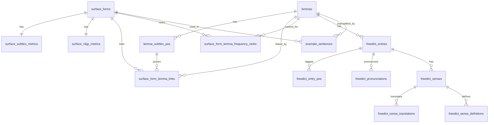

# Data Structure

## Tables

- `lemmas.tsv`: 10,000 rows
- `lemma_subtlex_pos.tsv`: 10,112 rows
- `surface_forms.tsv`: 124,536 rows
- `surface_subtlex_metrics.tsv`: 124,536 rows
- `surface_nkjp_metrics.tsv`: 124,536 rows
- `surface_form_lemma_links.tsv`: 126,449 rows
- `surface_form_lemma_frequency_ranks.tsv`: 126,377 rows
- `freedict_entries.tsv`: 10,262 rows
- `freedict_entry_pos.tsv`: 10,257 rows
- `freedict_pronunciations.tsv`: 8,352 rows
- `freedict_senses.tsv`: 15,211 rows
- `freedict_sense_translations.tsv`: 25,772 rows
- `freedict_sense_definitions.tsv`: 16,972 rows
- `example_sentences.tsv`: 1,830 rows
- `rejected_lemmas.tsv`: 527,379 rows
- `rejected_surfaces.tsv`: 863,375 rows
- `rejected_freedict_rows.tsv`: 49,813 rows
- `nkjp_build_stats.tsv`: 8 rows

## Entity Relationship Diagram

## Notes

- IDs are deterministic integers assigned after deterministic sorts.
- Natural uniqueness is also enforced in `schema.sql`.
- Audit tables are loadable schema tables, not optional diagnostics.
- TSV nulls are encoded as `\N`.
